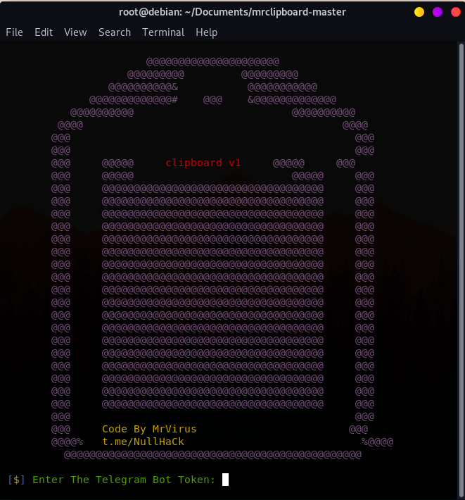

<h1>clipboard</h1>
 

 
Hijacking Clipboard Data By Link
 
<h1>prerequisites</h1>
<pre>
<code>$ apt update -y  
$ apt install git php python openssh -y</code>
</pre>
 
<h1>run</h1>
<pre>
<code>$ git clone https://github.com/null-hack/mrclipboard  
$ cd mrclipboard  
$ python3 mrclipboard.py</code>
</pre>  
<a href="https://t.me/NullHaCk">Telegram Channel</a>
